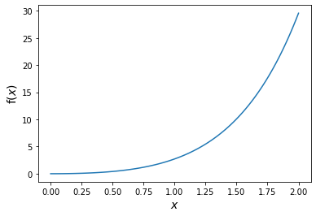

.. _tutorial:

Tutorial
===============

*torchquad* is a dedicated module for numerical integration in arbitrary dimensions.
This tutorial gives a more detailed look at its functionality and explores some performance considerations.

Minimal working example
-----------------------

.. code:: ipython3

    # To avoid copying things to GPU memory, 
    # ideally allocate everything in torch on the GPU
    # and avoid non-torch function calls
    import torch 
    from torchquad import MonteCarlo, enable_cuda

    # Enable GPU support if available
    enable_cuda() 

    # The function we want to integrate, in this example f(x0,x1) = sin(x0) + e^x1 for x0=[0,1] and x1=[-1,1]
    # Note that the function needs to support multiple evaluations at once (first dimension of x here)
    # Expected result here is ~3.2698
    def some_function(x):
        return torch.sin(x[:,0]) + torch.exp(x[:,1]) 

    # Declare an integrator, here we use the simple, stochastic Monte Carlo integration method
    mc = MonteCarlo()

    # Compute the function integral by sampling 10000 points over domain 
    integral_value = mc.integrate(some_function,dim=2,N=10000,integration_domain = [[0,1],[-1,1]])

Detailed Introduction
---------------------

The main problem with higher-dimensional numerical integration is that
the computation simply becomes too costly if the dimensionality, *n*, is large, as the number
of evaluation points increases exponentially - this problem is known as
the *curse of dimensionality*. This especially affects grid-based
methods, but is, to some degree, also present for Monte Carlo methods,
which also require larger numbers of points for convergence in higher
dimensions.

At the time, *torchquad* offers the following integration methods for
abritrary dimensionality.

+--------------+-------------------------------------------------+------------+
| Name         | How it works                                    | Spacing    |
|              |                                                 |            |
+==============+=================================================+============+
| Trapezoid    | Creates a linear interpolant between two |br|   | Equal      |
| rule         | neighbouring points                             |            |
+--------------+-------------------------------------------------+------------+
| Simpson's    | Creates a quadratic interpolant between |br|    | Equal      |
| rule         | three neighbouring point                        |            |
+--------------+-------------------------------------------------+------------+
| Boole's      | Creates a more complex interpolant between |br| | Equal      |
| rule         | five neighbouring points                        |            |
+--------------+-------------------------------------------------+------------+
| Monte Carlo  | Randomly chooses points at which the |br|       | Random     |
|              | integrand is evaluated                          |            |
+--------------+-------------------------------------------------+------------+
| VEGAS        | Adaptive multidimensional Monte Carlo |br|      | Stratified |
| Enhanced     | integration (VEGAS with adaptive stratified     | |br|       |
| |br| (VEGAS+)| |br| sampling)                                  | sampling   |
+--------------+-------------------------------------------------+------------+

.. |br| raw:: html

      

Outline
-------

This tutorial is a guide for new users to *torchquad* and is structured in
the following way:

1.  Necessary imports for this tutorial
2.  Example integration in one dimension (1-D) with complex numbers
3.  Example integration in ten dimensions (10-D)
4.  Some accuracy / runtime comparisons with scipy
5.  Example showing how gradients can be obtained w.r.t. the integration domain

Feel free to test the code on your own computer as we go along.

Imports
-------

Now let’s get started! First, the general imports:

.. code:: ipython3

    import scipy
    import numpy as np
    
    # For benchmarking
    import time
    from scipy.integrate import nquad
    
    # For plotting
    import matplotlib.pyplot as plt
    
    # To avoid copying things to GPU memory, 
    # ideally allocate everything in torch on the GPU
    # and avoid non-torch function calls
    import torch
    torch.set_printoptions(precision=10) # Set displayed output precision to 10 digits
    
    from torchquad import enable_cuda # Necessary to enable GPU support
    from torchquad import Trapezoid, Simpson, Boole, MonteCarlo, VEGAS # The available integrators
    from torchquad.utils.set_precision import set_precision
    import torchquad

.. code:: ipython3

    enable_cuda() # Use this to enable GPU support 

.. parsed-literal::

    **Output:** Initializing torchquad.
            PyTorch VERSION: 1.9.0
            CUDNN VERSION: 7605
            Number of CUDA Devices: 1
            Active CUDA Device: GPU0
            Setting default tensor type to cuda.Float32 (CUDA is initialized).

One-dimensional integration
------------------------------------------------

To make it easier to understand the methods used in this tutorial, we will start with an
example in one dimension. If you are new to these methods or simply want a clearer picture, 
feel free to check out Patrick Walls’ 
`nice Python introduction <https://github.com/patrickwalls/mathematical-python/>`__ 
to the `Trapezoid rule <https://www.math.ubc.ca/~pwalls/math-python/integration/trapezoid-rule/>`__
and `Simpson's rule <https://www.math.ubc.ca/~pwalls/math-python/integration/simpsons-rule/>`__
in one dimension.
Similarly, `Tirthajyoti Sarkar <https://github.com/tirthajyoti>`__ has made a nice visual explanation of 
`Monte Carlo integration in Python 
<https://towardsdatascience.com/monte-carlo-integration-in-python-a71a209d277e>`__.

*torchquad* is compatible with complex numbers. To showcase this, in the following example we 
will let ``f(x)`` be the complex function :math:`f(x) = e^{3ix} \cdot x^{2}` (real integrands can be used in the exact same way). Over the domain 
:math:`[0,2]`, the integral of ``f(x)`` is :math:`\int_{0}^{2} f(x) dx = 
\int_{0}^{2} e^{3ix} \cdot x^{2} dx = -\frac{2}{27} i ( 1 + (17 + 6i) e^{6i} )`, or, alternatively, 
:math:`0.0748857930... - i1.4073621035...` 
(see `Wolfram Alpha <https://www.wolframalpha.com/input/?i=integral+of+e%5E%283ix%29+*+x%5E%282%29+from+0+to+2>`__ 
if you don't belive us).

Let’s declare the function ``f(x)``, a simple helper function to print the absolute error, 
as well as remember the correct result.

.. code:: ipython3

    def f(x):
        return torch.exp(3.0j*x) * torch.pow(x,2)
    
    def print_error(result,solution):
        print("Results:", result.item())
        print(f"Abs. Error: {(torch.abs(result - solution).item()):.8e}")
        print(f"Rel. Error: {(torch.abs((result - solution) / solution).item()):.8e}")
    
    solution = -2.0j / 27.0 * (1.0 + (17.0 + 6.0j) * torch.exp(torch.tensor([6.0j])) )

**Note that we are using the torch versions of functions like ``exp`` to ensure that all variables
are and stay on the GPU.** 
**Also, note:** the unit imaginary number :math:`i` is written as ``j`` in Python.

Let’s plot the function briefly.

.. code:: ipython3

    points = torch.linspace(0,2,100)
    real_part = f(points).real
    imag_part = f(points).imag

    plt.plot(points.cpu(),real_part.cpu()) # Note that for plotting we have to move 
    plt.plot(points.cpu(),imag_part.cpu()) # the values to the CPU first
    # The code for the legend and labels have been hidden here for readability

Let’s define the integration domain, set the precision to double, and initialize the integrator - let’s start with the trapezoid rule.

.. code:: ipython3

    # Integration domain is always a list of lists to allow arbitrary dimensionality.
    integration_domain = [[0, 2]]
    set_precision('double')
    tp = Trapezoid()  # Initialize a trapezoid solver

Now we are all set to compute the integral. Let’s try it with just 101 sample points for now.

.. code:: ipython3

    result = tp.integrate(f, dim=1, N=101, integration_domain=integration_domain)
    print_error(result,solution)

.. parsed-literal::

    **Output:** Results: (0.0751256138749595-1.4070152346569569j)
            Abs. Error: 4.21725301e-04
            Rel. Error: 2.99233274e-04
    

This is quite close already, as 1-D integrals are comparatively easy.
Let’s see what type of value we get for different integrators.

.. code:: ipython3

    simp = Simpson()
    result = simp.integrate(f, dim=1, N=101, integration_domain=integration_domain)
    print_error(result,solution)

.. parsed-literal::

    **Output:** Results: (0.0748856817342774-1.407362129881349j)
            Abs. Error: 1.11758709e-07
            Rel. Error: 7.92978838e-08
    
.. code:: ipython3

    boole = Boole()
    result = boole.integrate(f, dim=1, N=101, integration_domain=integration_domain)
    print_error(result,solution)

.. parsed-literal::

    **Output:** Results: (0.07488579656243394-1.407362063802251j)
            Abs. Error: 0.00000000e+00
            Rel. Error: 0.00000000e+00

.. code:: ipython3

    mc = MonteCarlo()
    result = mc.integrate(f, dim=1, N=101, integration_domain=integration_domain)
    print_error(result,solution)

.. parsed-literal::

    **Output:** Results: (0.1345164951606459-1.1738163554904042j)
            Abs. Error: 2.41038278e-01
            Rel. Error: 1.71027616e-01
    

Notably, Simpson's and Boole's methods are already really good here with only 101 points. 
Monte Carlo methods do not perform so well; they are more suited to higher-dimensional integrals. 
VEGAS currently requires a larger number of samples to function correctly (as it performs several
iterations) and it doesn't currently support complex numbers. We're working hard on adding this feature.

Let’s step things up now and move to a ten-dimensional problem.

High-dimensional integration
----------------------------

Now, we will investigate the following ten-dimensional problem:

Let ``f_2`` be the function :math:`f_{2}(x) = \sum_{i=1}^{10} \sin(x_{i})`.

Over the domain :math:`[0,1]^{10}`, the integral of ``f_2`` is
:math:`\int_{0}^{1} \dotsc \int_{0}^{1} \sum_{i=1}^{10} \sin(x_{i}) = 20 \sin^{2}(1/2) = 4.59697694131860282599063392557 \dotsc`

Plotting this is tricky, so let’s directly move to the integrals.

.. code:: ipython3

    def f_2(x):
        return torch.sum(torch.sin(x),dim=1)
    
    solution = 20*(torch.sin(torch.tensor([0.5]))*torch.sin(torch.tensor([0.5])))

Let’s start with just 5 points per dimension, i.e., :math:`5^{10}=9,765,625` sample points. 

**Note**: *torchquad* currently only supports equal numbers of points per dimension. 
We are working on giving the user more flexibility on this point.

.. code:: ipython3

    # Integration domain always is a list of lists to allow arbitrary dimensionality
    integration_domain = [[0, 1]]*10 
    set_precision('float')
    N = 5**10 

.. code:: ipython3

    tp = Trapezoid()  # Initialize a trapezoid solver
    result = tp.integrate(f_2, dim=10, N=N, integration_domain=integration_domain)
    print_error(result,solution)

.. parsed-literal::

    **Output:** Results: 4.573010444641113
            Abs. Error: 2.39667892e-02
            Rel. Error: 5.21359732e-03
    

.. code:: ipython3

    simp = Simpson()  # Initialize Simpson solver
    result = simp.integrate(f_2, dim=10, N=N, integration_domain=integration_domain)
    print_error(result,solution)

.. parsed-literal::

    **Output:** Results: 4.597078323364258
            Abs. Error: 1.01089478e-04
            Rel. Error: 2.19904232e-05
    

.. code:: ipython3

    boole = Boole()  # Initialize Boole solver
    result = boole.integrate(f_2, dim=10, N=N, integration_domain=integration_domain)
    print_error(result,solution)

.. parsed-literal::

    **Output:** Results: 4.596974849700928
            Abs. Error: 2.38418579e-06
            Rel. Error: 5.18642082e-07
            

.. code:: ipython3

    mc = MonteCarlo()
    result = mc.integrate(f_2, dim=10, N=N, integration_domain=integration_domain, seed=42)
    print_error(result,solution)

.. parsed-literal::

    **Output:** Results: 4.597158908843994
            Abs. Error: 1.81674957e-04
            Rel. Error: 3.95205243e-05
    

.. code:: ipython3

    vegas = VEGAS()
    result = vegas.integrate(f_2,dim=10,N=N,integration_domain=integration_domain,use_warmup=False,use_grid_improve=False)    
    print_error(result,solution)

.. parsed-literal::

    **Output:** Results: 4.596913814544678
            Abs. Error: 6.34193420e-05
            Rel. Error: 1.37958787e-05
    

Note that the Monte Carlo methods are much more competitive in this case. 
The bad convergence properties of the trapezoid method are visible while Simpson's 
and Boole's rule are still OK given the comparatively smooth integrand. 

If you have been repeating the examples from this tutorial on your own computer, you 
might get ``RuntimeError: CUDA out of memory`` if you have a small GPU.
In that case, you could also try to reduce the number of sample points (e.g., 3 per dimension).
You can really see the curse of dimensionality fully at play here, since :math:`5^{10}=9,765,625`
but :math:`3^{10}=59,049`, reducing the number of sample points by a factor of 165.
Note, however, that Boole's method cannot work for only 3 points per dimension, so the number of sample points is therefore 
automatically increased to 5 per dimension for this method.

Comparison with scipy
---------------------

Let’s explore how *torchquad*’s performance compares to scipy, the go-to
tool for numerical integration. A more detailed exploration of this
topic might be done as a side project at a later time. For simplicity,
we will stick to a 5-D version of the :math:`\sin(x)` of the previous
section. Let’s declare it with numpy and torch. Numpy arrays will
remain on the CPU and torch tensor on the GPU.

.. code:: ipython3

    dimension = 5
    integration_domain = [[0, 1]]*dimension
    ground_truth = 2 * dimension * np.sin(0.5)*np.sin(0.5)
    
    def f_3(x):
        return torch.sum(torch.sin(x),dim=1)
    
    def f_3_np(*x):
        return np.sum(np.sin(x))

Now let’s evaluate the integral using the scipy function ``nquad``.

.. code:: ipython3

    start = time.time()
    opts={"limit": 10, "epsabs" : 1, "epsrel" : 1}
    result, _,details = nquad(f_3_np, integration_domain, opts=opts, full_output=True) 
    end = time.time()
    print("Results:",result)
    print("Abs. Error:",np.abs(result - ground_truth))
    print(details)
    print(f"Took {(end-start)* 1000.0:.3f} ms")

.. parsed-literal::

    **Output:** Results: 2.2984884706593016
            Abs. Error: 0.0
            {'neval': 4084101}
            Took 33067.629 ms
    

Using scipy, we get the result in about 33 seconds on the authors’
machine (this might take shorter or longer on your machine). The integral was computed with
``nquad``, which on the inside uses the highly adaptive
`QUADPACK <https://en.wikipedia.org/wiki/QUADPACK>`__ algorithm.

In any event, *torchquad* can reach the same accuracy much, much quicker
by utilizing the GPU. 

.. code:: ipython3

    N = 37**dimension 
    simp = Simpson()  # Initialize Simpson solver
    start = time.time()
    result = simp.integrate(f_3, dim=dimension, N=N, integration_domain=integration_domain)
    end = time.time()
    print_error(result,ground_truth)
    print('neval=',N)
    print(f"Took {(end-start)* 1000.0:.3f} ms")

If you tried this yourself and ran out of CUDA memory, simply decrease :math:`N` 
(this will, however, lead to a loss of accuracy). 

Note that we use more evaluation points (:math:`37^{5}=69,343,957` for *torchquad* vs. :math:`4,084,101` 
for scipy), given the comparatively simple algorithm. 
Anyway, the decisive factor for this specific problem is runtime. A comparison with regard to
function evaluations is difficult, as ``nquad`` provides no support for a
fixed number of evaluations. This may follow in the future.

The results from using Simpson's rule in *torchquad* is: 

.. parsed-literal::

    **Output:** Results: 2.2984883785247803
            Abs. Error: 0.00000000e+00
            Rel. Error: 0.00000000e+00
            neval= 69343957
            Took 162.147 ms
    

In our case, *torchquad*  with Simpson's rule was more than 300 times faster than
``scipy.integrate.nquad``. We will add
more elaborate integration methods over time; however, this tutorial should
already showcase the advantages of numerical integration on the GPU.

Reasonably, one might prefer Monte Carlo integration methods for a 5-D
problem. We might add this comparison to the tutorial in the future.

Computing gradients with respect to the integration domain
----------------------------------------------------------

*torchquad* allows fully automatic differentiation. In this tutorial, we will show how to extract the gradients with respect to the integration domain.
We selected the Trapezoid rule and the Monte Carlo method to showcase that getting gradients is possible for both deterministic and stochastic methods.

.. code:: ipython3

    def test_function(x):
        """V shaped test function."""
        return 2 * torch.abs(x)

    enable_cuda()
    set_precision("double")
    N = 99997 # Number of iterations
    torch.manual_seed(0)  # We have to seed torch to get reproducible results
    integrators = [MonteCarlo(), Trapezoid()]   # Define integrators

    for integrator in integrators:

        domain = torch.tensor([[-1.0, 1.0]]) #Integration domains
        domain.requires_grad = True # It enables the creation of a computational graph for gradient calculation.
        result = integrator.integrate(
            test_function, dim=1, N=N, integration_domain=domain
        ) # We calculate the 1-D integral by using the previously defined test-fuction

        result.backward() #Gradients computation

        print("Method:", integrator.__class__.__name__, " -  Gradients:", domain.grad)

The code above calculates the integral for a 1-D test-function ``test_function()`` in the [-1,1] domain and prints the gradients with respect to the integration domain.
The command ``domain.requires_grad = True`` enables the creation of a computational graph, and it should be called before calling the ``integrate(...)`` method.
Gradients computation is, then, performed calling ``result.backward()``. 
The output of the code is as follows:

.. parsed-literal::

    **Output:** Method: MonteCarlo  -  Gradients: tensor([[-2.0059064163,  2.0055464055]])
            Method: Trapezoid  -  Gradients: tensor([[-2.0000000000,  2.0000000000]])
